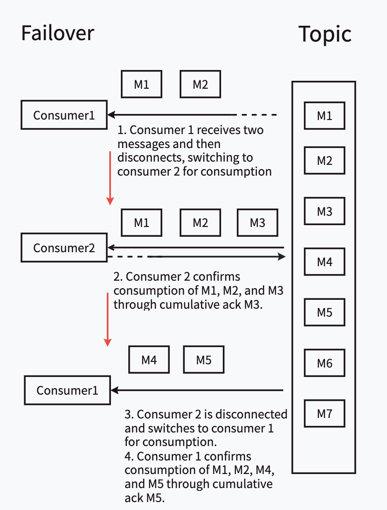

# PCIP-3：Pulsar Extended Transaction API Enhancement Proposal
# Background knowledge
When users consume messages using the Fail-over subscription mode and confirm messages using cumulative Ack, duplicate consumption may occur. In this case, even if users use Transaction, they cannot achieve Just-Once.
As shown in the figure below, in failover mode, the two consumer1 and consumer2 started simultaneously frequently undergo two disconnection switches.
Finally, Consumer1 consumed M1, M2, M4, M5; Consumer2 consumed M1, M2, M3. M1 and M2 were consumed twice.



# Goals
Solve the problem of cumulative ack consumption duplication by designing a new transaction API.
Why not fix this issue in the Pulsar main repository?
- The complexity of fixing problems without modifying the Client API is high, and the problem-solving cycle is long.
- There are indeed many confusing usage postures for existing transaction APIs
  - For example, the abort () and commit () methods may seem synchronous in name, but they are actually asynchronous. In actual use, you need to use abort ().get () and commit ().get ().
- Modifying the Client API in the Pulsar main repository is a difficult task because we cannot determine whether the new solution is necessarily perfect, and the time cycle for updating the API is long.
  The benefit of solving this problem in the contributor repository is:
- By wrapping the original Transaction API, this problem can be solved in a concise way. This wrapping can be seen as a best practice that does not affect the use of existing users, while providing a reference solution for users who encounter similar problems.
# High Level Design
Design a new API to place the context of message sending and consumption within Transaction, which not only solves the problem of repeated consumption, but also retains sufficient scalability for possible optimization in the future.
- Solve the problem of repeated consumption - use the function of individual ack messagelist to batch ack messages instead of the original cumulative ack.
- Retained sufficient scalability - sending messages requires using Transaction to construct messages, and consumed transaction messages are recorded in Transaction. Later, more optimizations can be added using this information without changing the interface.

## Public-facing Changes
### Public API
The org.apache.pulsar.txn.api.Transaction interface is an optimized and extended transaction interface designed to enhance usability and clarity in the Pulsar contributors' library. It addresses issues with CumulativeAck and transactions not preventing repeated message consumption, and it refines ambiguous methods for better clarity. Key features include:
- Message Recording: Records messages in a transaction without automatic acknowledgment.
- Asynchronous and Synchronous Acknowledgment: Supports both asynchronous and synchronous acknowledgment of all received messages for specific consumers or across all consumers.
- Transactional Message Builder: Creates a new transactional message builder for a given producer to construct and send messages within a transaction context.
- Committing and Aborting Transactions: Offers both asynchronous and synchronous methods to commit or abort transactions, ensuring the effectiveness of message sends and acknowledgments.
- Transaction ID and State Retrieval: Provides methods to retrieve the unique transaction ID and its current state to determine the transaction's lifecycle phase.
```java
/**
* Interface representing an optimized and extended transaction interface in the Pulsar
* contributors' library.
*
* <p>This interface provides enhancements and extensions to the base transaction interface in
* Pulsar. It specifically addresses the issue where using CumulativeAck with transactions could not
* prevent message consumed repeated. Additionally, it clarifies and optimizes ambiguous methods for
* better usability and clarity.
  */
  public interface Transaction {

/**
* Records a message in the transaction.
*
* <p>This method is used to include a message in the current transaction. The message will not be
* automatically acknowledged when the transaction is committed. Instead, it must be explicitly
* acknowledged by calling one of the ack methods.
*
* @param messageId the ID of the message to record
* @param consumer the consumer that received the message
  */
  void recordMsg(MessageId messageId, Consumer<?> consumer);

/**
* Asynchronously acknowledges all received messages for a specific consumer in the transaction.
*
* <p>This method is used to acknowledge all messages that have been recorded for the specified
* consumer in the transaction. The acknowledgment is asynchronous, and the future can be used to
* determine when the operation is complete.
*
* @param consumer the consumer that received the messages
* @return a CompletableFuture that will be completed when the acknowledgment is complete
  */
  CompletableFuture<Void> ackAllReceivedMsgsAsync(Consumer<?> consumer);

/**
* Acknowledges all received messages for a specific consumer in the transaction.
*
* <p>This method is a synchronous version of {@link #ackAllReceivedMsgsAsync(Consumer)}. It will
* block until the acknowledgment is complete.
*
* @param consumer the consumer that received the messages
* @throws ExecutionException if the acknowledgment fails
* @throws InterruptedException if the thread is interrupted while waiting for the acknowledgment
*     to complete
*/
void ackAllReceivedMsgs(Consumer<?> consumer) throws ExecutionException, InterruptedException;

/**
* Acknowledges all received messages in the transaction.
*
* <p>This method is a convenience method that acknowledges all messages across all consumers. It
* will block until the acknowledgment is complete.
*
* @throws ExecutionException if the acknowledgment fails
* @throws InterruptedException if the thread is interrupted while waiting for the acknowledgment
*     to complete
*/
void ackAllReceivedMsgs() throws ExecutionException, InterruptedException;

/**
* Asynchronously acknowledges all received messages in the transaction.
*
* <p>This method is a convenience method that acknowledges all messages across all consumers. The
* acknowledgment is asynchronous, and the future can be used to determine when the operation is
* complete.
*
* @return a CompletableFuture that will be completed when the acknowledgment is complete
  */
  CompletableFuture<Void> ackAllReceivedMsgsAsync();

/**
* Creates a new transactional message builder for the given producer.
*
* <p>This method returns a {@link TypedMessageBuilder} instance that is bound to the specified
* producer and transaction. The returned message builder can be used to construct and send
* messages within the context of a transaction.
*
* @param producer the producer instance used to send messages
* @param <T> the type of messages produced by the producer
* @return a TypedMessageBuilder instance for building transactional messages
  */
  <T> TypedMessageBuilder<T> newTransactionMessage(Producer<T> producer);

/**
* Asynchronously commits the transaction.
*
* <p>This method is used to commit the transaction, making all sent messages and acknowledgments
* effective. When the transaction is committed, consumers receive the transaction messages and
* the pending-ack state becomes ack state. The commit is asynchronous, and the future can be used
* to determine when the operation is complete.
*
* @return a CompletableFuture that will be completed when the commit is complete
  */
  CompletableFuture<Void> commitAsync();

/**
* Asynchronously aborts the transaction.
*
* <p>This method is used to abort the transaction, discarding all send messages and
* acknowledgments. The abort is asynchronous, and the future can be used to determine when the
* operation is complete.
*
* @return a CompletableFuture that will be completed when the abort is complete
  */
  CompletableFuture<Void> abortAsync();

/**
* Commits the transaction.
*
* <p>This method is a synchronous version of {@link #commitAsync()}. It will block until the
* commit is complete.
*
* @throws ExecutionException if the commit fails
* @throws InterruptedException if the thread is interrupted while waiting for the commit to
*     complete
*/
void commit() throws ExecutionException, InterruptedException;

/**
* Aborts the transaction.
*
* <p>This method is a synchronous version of {@link #abortAsync()}. It will block until the abort
* is complete.
*
* @throws ExecutionException if the abort fails
* @throws InterruptedException if the thread is interrupted while waiting for the abort to
*     complete
*/
void abort() throws ExecutionException, InterruptedException;

/**
* Gets the transaction ID.
*
* <p>This method returns the unique identifier for the transaction.
*
* @return the transaction ID
  */
  TxnID getTxnID();

/**
* Gets the current state of the transaction.
*
* <p>This method returns the current state of the transaction, which can be used to determine if
* the transaction is open, committed, aborted, error or timeout.
*
* @return the current state of the transaction
  */
  org.apache.pulsar.client.api.transaction.Transaction.State getState();
  }
```  

# Get started
## Quick Start
```java
public void transactionDemo() throws Exception {
String pubTopic = "persistent://public/default/my-pub-topic";
String subTopic = "persistent://public/default/my-sub-topic";
String subscription = "my-subscription";

// Create a Pulsar client instance
PulsarClient client = SingletonPulsarContainer.createPulsarClient();

// Create a Transaction object
// Use TransactionFactory to create a transaction object with a timeout of 5 seconds
Transaction transaction =
TransactionFactory.createTransaction(client, 5, TimeUnit.SECONDS).get();

// Create producers and a consumer
// Create two producers to send messages to different topics
Producer<String> producerToPubTopic = client.newProducer(Schema.STRING).topic(pubTopic).create();
Producer<String> producerToSubTopic = client.newProducer(Schema.STRING).topic(subTopic).create();

// Create a consumer to receive messages from the subTopic
Consumer<String> consumerFromSubTopic = client
.newConsumer(Schema.STRING)
.subscriptionName(subscription)
.topic(subTopic)
.subscribe();

// Send a message to the Sub Topic
producerToSubTopic.send("Hello World");

// Receive a message
Message<String> receivedMessage = consumerFromSubTopic.receive();
MessageId receivedMessageId = receivedMessage.getMessageId();

// Record the message in the transaction
transaction.recordMsg(receivedMessageId, consumerFromSubTopic);

// Forward the transaction message to the pub topic
// Use the transaction message builder to forward the received message to the pubTopic
transaction.newTransactionMessage(producerToSubTopic).value(receivedMessage.getValue()).send();

// Acknowledge all received messages
// Acknowledge all messages received from the subTopic within the transaction
transaction.ackAllReceivedMsgs(consumerFromSubTopic);

// Commit the transaction
// Commit the transaction to ensure all recorded messages and acknowledgments take effect
transaction.commit();

// Close the consumer, producers, and client to release resources
consumerFromSubTopic.close();
producerToSubTopic.close();
client.close();
}
```