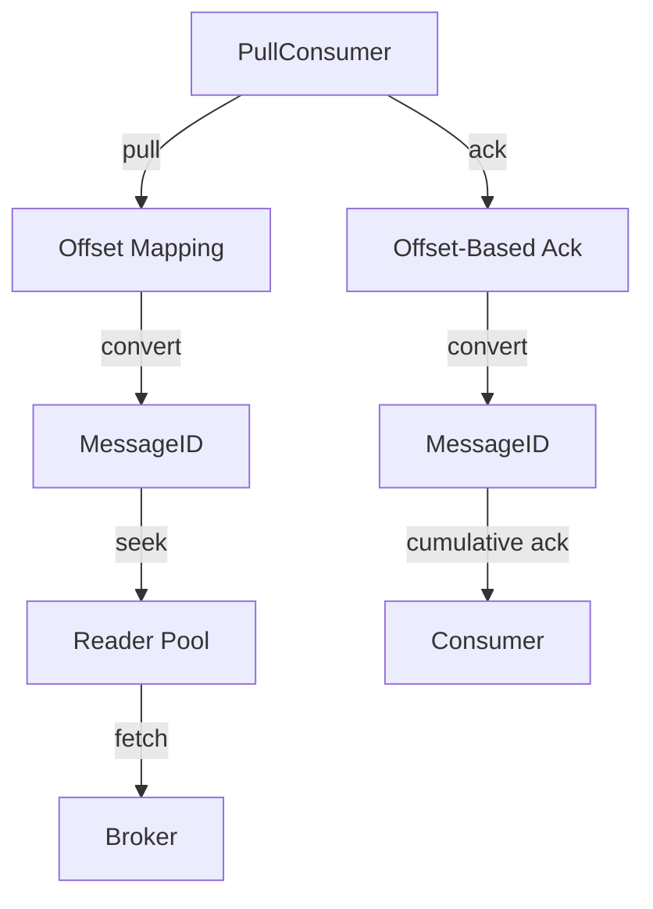

# PCIP-4: Pull Consumer Implementation for Apache Pulsar

# Background knowledge

- **Pulsar Consumers**: Pulsar currently supports push-based consumption models (exclusive/shared/failover/key-shared).
  This proposal adds pull-based consumption.
- **Message Positioning**: Pulsar uses composite MessageIDs (ledgerId + entryId + partitionId), while systems like
  Kafka/RocketMQ use monotonic offsets.
- **Offset Mapping**: https://github.com/apache/pulsar/pull/24220 can be used to convert between offsets and Pulsar's
  MessageIDs.

# Motivation

System Migration Requirement: The organization plans to migrate from RocketMQ to Pulsar, requiring a unified MQ client
abstraction layer to conceal implementation details and support seamless engine replacement.

Interface Compatibility Issues:

- Pulsar lacks a native offset retrieval interface (pull/fetch model).
- RocketMQ/Kafka use monotonically increasing numeric offsets to locate messages, whereas Pulsar employs a composite
  MessageID (ledgerId + entryId + partitionId).

Objective: Implement a RocketMQ-like Pull Consumer to support precise offset control and reduce migration costs.

# Goals

## In Scope

| Goal                       | Description                                                               |  
|----------------------------|---------------------------------------------------------------------------|  
| **Precise Offset Control** | Supports specifying partition, offset, pull count, and byte size.         |  
| **Resource Efficiency**    | Reuses Reader connections with LRU cache management.                      |  
| **Easy Integration**       | Compatible with Pulsar’s existing API, requiring no Broker modifications. |  

## Out of Scope

NA

# High Level Design



Key components:

1. **`PulsarPullConsumer` interface**: Standard pull consumer API
2. **Offset ↔ MessageID Cache**: Partition-scoped mapping layer
3. **Reader Pool**: Managed resource pool with LRU eviction
4. **Partition Locking**: Thread-safe access coordination

## Detailed Design

### Design & Implementation Details

**Core Interface** `PulsarPullConsumer`:

```java
public interface PulsarPullConsumer<T> extends AutoCloseable {
    void start() throws PulsarClientException;

    List<Message<T>> pull(PullRequest request);

    void ack(long offset, int partition) throws PulsarClientException;

    long searchOffset(int partition, long timestamp) throws PulsarAdminException;

    long getConsumeStats(int partition) throws PulsarAdminException;

    class PullRequest {
        private long offset;
        private int partition;
        private int maxMessages;
        private int maxBytes;
        private Duration timeout;
    }
}
```

**Reader Management** :

```java
public class ReaderCache<T> {
    private final Map<String, LoadingCache<Long, Reader<T>>> readerCacheMap;

    public Reader<T> getReader(String topic, long offset) {
        // 1. Acquire partition lock
        // 2. Get/create LRU cache (default: max 100 readers/partition)
        // 3. Remove reader from cache for exclusive use
    }

    public void releaseReader(String topic, long nextOffset, Reader<T> reader) {
        // Return reader to cache if still connected
    }
}
```

**Offset Mapping**:

```java
public class OffsetToMessageIdCache {
    private final Map<String, LoadingCache<Long, MessageId>> partitionCaches;

    public MessageId getMessageIdByOffset(String topic, long offset) {
        // 1. Check caffeine cache (default: max 1000 entries/partition)
        // 2. On cache miss: pulsarAdmin.topics().getMessageIDByOffset()
        // 3. Populate cache
    }
}
```

### Public-facing Changes

#### Public API

**New Interfaces**:

```java
// Entry point
PulsarPullConsumer<byte[]> pullConsumer1 = new PulsarPullConsumerImpl<>(
        nonPartitionedTopic, subscription,
        brokerCluster, Schema.BYTES,
        pulsarClient, pulsarAdmin);

// Usage
List<Message<byte[]>> messages = pullConsumer1.pull(
        PulsarPullConsumer.PullRequest.builder()
                .offset(offset)
                .partition(PulsarPullConsumer.PARTITION_NONE)
                .maxMessages(10)
                .maxBytes(1024 * 1024)
                .timeout(java.time.Duration.ofSeconds(10))
                .build());
```

## Get Started

### Quick Start

```java
// 1. Create pull consumer
PulsarPullConsumer<byte[]> pullConsumer1 = new PulsarPullConsumerImpl<>(
        nonPartitionedTopic, subscription,
        brokerCluster, Schema.BYTES,
        pulsarClient, pulsarAdmin);

consumer.start();  // Initialize connections

// 2. Pull messages from partition 0 starting at offset 200
List<Message<byte[]>> batch =  pullConsumer1.pull(
        PulsarPullConsumer.PullRequest.builder()
                .offset(offset)
                .partition(PulsarPullConsumer.PARTITION_NONE)
                .maxMessages(10)
                .maxBytes(1024 * 1024)
                .timeout(java.time.Duration.ofSeconds(10))
                .build());
);

// 3. Process messages batch.

forEach(msg ->{
        System.out.println("Received: "+new String(msg.getData()));
        // Store last offset
        });

// 4. Acknowledge up to last offset
consumer.ack(250L,0);

// 5. Close resources
consumer.close();
```